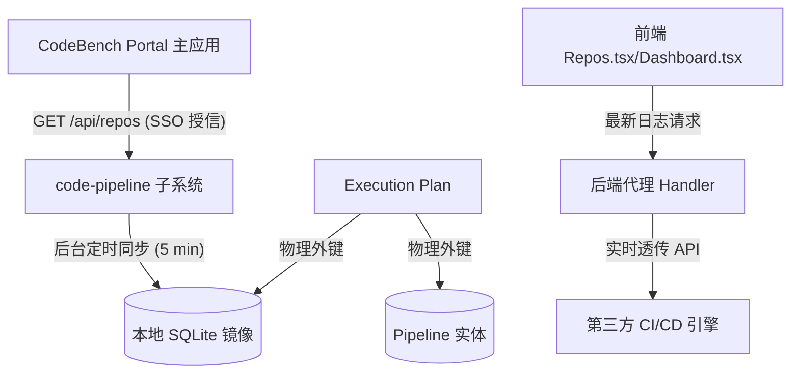

# Code Pipeline 流水线管理与检查系统 (Remote)

`code-pipeline` 是 CodeBench 微前端集成工作台下的**持续集成与交付流水线管理**子系统。该项目作为微前端 Remote 应用，通过 Vite Module Federation (模块联邦) 动态拼装入 CodeBench Portal 宿主中运行。

本系统定位为**第三方 CI/CD 流水线的统一交互与管理控制台**。它旨在为研发人员提供统一的代码仓分支流水线绑定界面、三方运行日志实时穿透查询、以及项目集成指标的大盘看板。

---

## 🎯 核心设计目标

1. **内聚的流水线配置管理**：面向多分支研发场景，将流水线执行方案（Execution Plan）与代码仓多分支进行精细化绑定，消除各独立子系统重复录入仓库数据的冗余。
2. **轻量与高响应度**：本地不存储海量的执行日志，通过高性能 API 代理机制实时穿透查询第三方 CI/CD 系统的实际运行日志和输出流，极大地减轻本地数据库的存储负担。
3. **数据一致性保护**：采用只读镜像同步机制。代码仓的主配置完全托管在 Portal 主应用中，子系统采用单向 Pull（拉取）缓存模式，确保全局主数据权威源唯一。

---

## 🧩 系统架构与同步机制



### 1. 数据同步流 (S2S SSO 鉴权)
本系统后台挂载了常驻的定时同步器 (`StartRepoSyncTimer`)。每 5 分钟自动使用 Portal 间共享的对称密钥签发临时系统级 JWT，主动向 `code-bench` 拉取最新的代码仓数据，并增量更新到本地 `repositories` 只读缓存表中。对于未同步的代码仓，在操作执行方案时提供单条 Lazy Load 同步安全机制。

### 2. 实时代理透传日志
为了避免数据库膨胀并保证日志的最新状态，系统设计了**零本地执行日志库架构**。用户在前端控制中心、历史详情中查看控制台日志时，后端 Handler 通过代理调用将请求透传至真正的第三方流水线控制台，并返回高保真的执行轨迹。

---

## 💾 数据模型规范

### 1. 代码仓镜像 (Repository)
来自 `code-bench` 的只读主数据副本。

| 字段名称 | 类型 | 描述 |
| :--- | :--- | :--- |
| **ID** | Integer | 唯一标识符（对齐 Portal 端仓库 ID，主键） |
| **Name** | String | 仓库别名/应用项目名称 |
| **URL** | String | 仓库克隆地址 (Git URL) |
| **OwnerID** | Integer | 负责人 ID |
| **IsActive** | Boolean | 是否在 Portal 端被启用/冻结 |
| **CreatedAt** | DateTime | 创建时间 |

### 2. 流水线 (Pipeline)
定义对接的三方 CI/CD 流水线的标识与连接参数。

| 字段名称 | 类型 | 描述 |
| :--- | :--- | :--- |
| **ID** | Integer | 数据库物理自增主键 |
| **PipelineID** | String | 三方流水线系统中的唯一标识 ID（唯一索引） |
| **Name** | String | 流水线名称 |
| **Type** | String | 流水线触发运行类型（如 `MR`, `每日构建`） |
| **GroupName** | String | 分组名称 |
| **Description** | String | 详细描述信息 |
| **ServiceID** | String | 三方服务 ID |
| **WorkspaceID** | String | 三方工作空间 ID |
| **Owner** | String | 负责人 |
| **ServiceName** | String | 服务名称 |

### 3. 执行方案 (ExecutionPlan)
定义代码仓特定分支与流水线之间的具体绑定策略。

| 字段名称 | 类型 | 描述 |
| :--- | :--- | :--- |
| **ID** | Integer | 数据库物理自增主键 |
| **ExecutionPlanID** | String | 对应的三方系统执行方案 ID 标识 |
| **PipelineID** | Integer | 关联的 Pipeline ID (物理外键) |
| **RepositoryID** | Integer | 关联的只读镜像 Repository ID (物理外键) |
| **Branch** | String | 绑定的代码构建/检查分支 |
| **Username** | String | 访问代码仓凭证用户名 |
| **Password** | String | 访问代码仓凭证密码 |
| **Languages** | String | 选用的编程语言（如 `C/C++,Python`） |
| **CodeCheckerTaskID** | String | 代码静态检查工具任务 ID |
| **CustomAttributes** | String (JSON) | 自定义拓展属性（JSON 格式文本） |

---

## 🛠️ 快速开发与编译部署

### 1. 全系统构建与编译
我们在根目录下提供了 `Makefile` 进行一键构建：
```bash
# 一键安装前端依赖、构建打包前端，并编译 Go 后端
make build
```
编译产物会在根目录下生成 `code-pipeline` 二进制可执行文件。

### 2. 前端独立运行与调试
```bash
# 切换至前端目录并安装依赖
cd frontend && npm install

# 启动 Vite 开发服务器（HMR 模式）
npm run dev
```

### 3. 配置文件 (config.yaml)
服务启动时会默认读取根目录下的 `config.yaml`。需要在其中正确配置 `code_bench` 接口地址及共享认证密钥：
```yaml
code_bench:
  api_url: "http://192.168.56.18:8000"  # Portal 宿主主应用的访问基准地址
```
