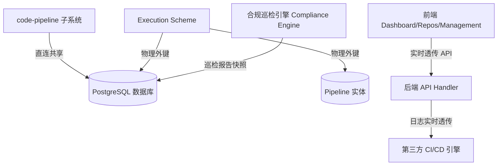

# Code Pipeline 流水线管理与检查系统 (Remote)

`code-pipeline` 是 CodeBench 微前端集成工作台下的**持续集成与交付流水线管理及代码仓合规管控**子系统。该项目作为微前端 Remote 应用，通过 Vite Module Federation (模块联邦) 动态拼装入 CodeBench Portal 宿主中运行。

本系统定位为**第三方 CI/CD 流水线的统一交互控制台与代码仓合规治理平台**。它旨在为研发人员提供统一的代码仓分支流水线绑定界面、三方运行日志实时穿透查询、每日构建错峰调度管理，以及全平台代码仓合规巡检与大盘看板。

---

## 🎯 核心设计目标

1. **内聚的流水线配置管理**：面向多分支研发场景，将流水线执行方案（Execution Scheme）与代码仓多分支进行精细化绑定，消除各独立子系统重复录入仓库数据的冗余。支持每日构建时间随机错峰打散（00:00 - 08:00），优化集群构建压力。
2. **轻量与高响应度**：本地不存储海量的执行日志，通过高性能 API 代理机制实时穿透查询第三方 CI/CD 系统的实际运行日志和输出流，极大地减轻本地数据库的存储负担。
3. **全方位的代码仓合规性管控**：构建内置合规巡检引擎，涵盖分支保护、工程规范、责任人归属、分支健康度、元信息规范及权限管控 6 大维度 11 项指标，自动生成仓库合规等级评分（A/B/C/D）与巡检报告。
4. **数据一致性保护**：采用 PostgreSQL 统一数据库共享架构。全平台微服务直连同一个数据库与 `repositories` / `users` / `departments` 共享主数据表，保障数据实时强一致。

---

## 🧩 系统架构与数据交互


```mermaid
graph TD
    CP[code-pipeline 子系统] -- "直连共享" --> PG[(PostgreSQL 数据库)]
    ES[Execution Scheme] -->|物理外键| PG
    ES -->|物理外键| PL[(Pipeline 实体)]
    CP_Engine[合规巡检引擎 Compliance Engine] -->|巡检报告快照| PG
    CP_Web[前端 Dashboard/Repos/Management] -- "实时透传 API" --> CP_API[后端 API Handler]
    CP_API -- "日志实时透传" --> Remote_CI[第三方 CI/CD 引擎]
```

### 1. 共享主数据模型
本系统与其他微服务（如 `code-bench`、`code-shield`、`code-pdm`）共享同一个 PostgreSQL 数据库与基础主表。代码仓（`repositories`）与用户（`users`）修改由 Portal 统一写入后，全平台实时可见，无需通过 HTTP 或定时任务同步。

### 2. 实时代理透传日志
为了避免数据库膨胀并保证日志的最新状态，系统设计了**零本地执行日志库架构**。用户在前端控制中心、历史详情中查看控制台日志时，后端 Handler 通过代理调用将请求透传至真正的第三方流水线控制台，并返回高保真的执行轨迹。

### 3. 被管代码仓与分支管控
`code-pipeline` 内置了**被管代码仓管理（Managed Repository）**模块，支持以嵌套组（ManagedGroup）为组织单元管理全平台被管代码仓：

*   **被管组与被管仓库**：支持嵌套组结构，可按组批量管理代码仓的归档、隐藏、成员权限等。
*   **分支健康度监控**：定期刷新并分析各被管仓分支状态，自动将分支分类为 `active`（活跃）、`merged_stale`（已合并待清理）、`unmerged_stale`（未合并僵尸）三种状态。
*   **保护分支规则**：支持配置分支模式匹配（如 `release/*`）的强制权限规则，包括禁止 Force Push 与要求 MR 审评。
*   **全员审批流**：建仓申请、保护分支配置变更等操作均需通过审批单（`ManagedRepoApproval`）流程。
*   **跨仓特性分支一键同步**：支持一次选定多个代码仓与基准分支，批量拉起特性分支，并记录批次内各仓拉起结果（`ManagedBatchBatchLog`）。
*   **模板占位符配置规范**：完整支持 HTTP Body 请求模板与 URL 占位符（如 `{REPO_NAME}`, `{GROUP_ID}`, `{TAG_LIST}`, `{CURRENT_TIME}` 等），详细说明请参阅 [template_placeholders.md](file:///home/fugui/codes/code-pipeline/docs/template_placeholders.md)。

### 4. 代码仓合规性管控体系
系统提供全方位的代码仓合规治理机制：
*   **6 大维度 11 项自动巡检**：
    *   **分支保护**：默认分支保护检查、保护分支覆盖率
    *   **工程规范**：代码检查任务绑定、流水线/执行方案绑定
    *   **责任归属**：仓库负责人设置、所属部门/子系统关联
    *   **分支健康**：未合并僵死分支上限控制、已合并滞留分支清理提示
    *   **元信息规范**：仓库描述与标签完备度
    *   **权限管控**：Owner 级别高权限成员数量管控
*   **全局统一合规基线**：管理员可统一设定各项检测规则的启停与阈值参数，系统根据扣分规则实时计算仓库得分并划分等级（**A 级 ≥ 90分**、**B 级 75-89分**、**C 级 60-74分**、**D 级 < 60分**）。
*   **合规 Dashboard 看板**：提供全站合规率 KPI 卡片、合规等级分布图表、僵死分支 Top5 榜单及高危仓库治理指引。

---

## 💾 数据模型规范

### 1. 代码仓表 (Repository)
全平台共享的 Repository 主数据实体。

| 字段名称 | 类型 | 描述 |
| :--- | :--- | :--- |
| **ID** | Integer | 唯一标识符（对齐 Portal 端仓库 ID，主键） |
| **Name** | String | 仓库别名/应用项目名称 |
| **URL** | String | 仓库克隆地址 (Git URL) |
| **OwnerID** | Integer | 负责人 ID |
| **IsActive** | Boolean | 是否在 Portal 端被启用/冻结 |
| **CreatedAt** | DateTime | 创建时间 |

### 2. 流水线 (Pipeline)
定义对接的三方 CI/CD 流水线的标识与连接参数。

| 字段名称 | 类型 | 描述 |
| :--- | :--- | :--- |
| **ID** | Integer | 数据库物理自增主键 |
| **PipelineID** | String | 三方流水线系统中的唯一标识 ID（唯一索引） |
| **Name** | String | 流水线名称 |
| **Type** | String | 流水线触发运行类型（如 `MR`, `每日构建`） |
| **GroupName** | String | 分组名称 |
| **Description** | String | 详细描述信息 |
| **ServiceID** | String | 三方服务 ID |
| **WorkspaceID** | String | 三方工作空间 ID |
| **Owner** | String | 负责人 |
| **ServiceName** | String | 服务名称 |

### 3. 执行方案 (ExecutionScheme)
定义代码仓特定分支与流水线之间的具体绑定策略。

| 字段名称 | 类型 | 描述 |
| :--- | :--- | :--- |
| **ID** | Integer | 数据库物理自增主键 |
| **ExecutionSchemeID** | String | 对应的三方系统执行方案 ID 标识 |
| **PipelineID** | Integer | 关联的 Pipeline ID (物理外键) |
| **RepositoryID** | Integer | 关联的只读镜像 Repository ID (物理外键) |
| **Branch** | String | 绑定的代码构建/检查分支 |
| **Username** | String | 访问代码仓凭证用户名 |
| **Password** | String | 访问代码仓凭证密码 |
| **Languages** | String | 选用的编程语言（如 `C/C++,Python`） |
| **DailyBuildTime** | String | 每日构建随机错峰触发时间 (默认 00:00 - 08:00) |
| **CodeCheckerTaskID** | String | 代码静态检查工具任务 ID |
| **CustomAttributes** | String (JSON) | 自定义拓展属性（JSON 格式文本） |

### 4. 合规基线模板 (ComplianceBaseline)
全局统一的代码仓合规检查基线规则配置实体。

| 字段名称 | 类型 | 描述 |
| :--- | :--- | :--- |
| **ID** | Integer | 物理主键 |
| **Name** | String | 基线模板名称（如 `全局通用代码仓合规基线`） |
| **Description** | String | 详细规则描述 |
| **IsDefault** | Boolean | 是否为默认应用的全局基线 |
| **Rules** | JSON | 包含 6 大维度 11 项规则的状态与阈值 JSON 数组 |

### 5. 仓库合规报告 (RepoComplianceReport)
被管仓自动巡检后生成的合规性评分快照记录。

| 字段名称 | 类型 | 描述 |
| :--- | :--- | :--- |
| **ID** | Integer | 物理主键 |
| **ManagedRepositoryID**| Integer | 关联的被管代码仓 ID (物理外键) |
| **BaselineID** | Integer | 绑定的合规基线 ID (物理外键) |
| **Score** | Integer | 合规得分 (0 - 100) |
| **Grade** | String | 合规等级 (A / B / C / D) |
| **TotalChecks** | Integer | 巡检项目总数 |
| **PassedChecks** | Integer | 通过检验数量 |
| **FailedChecks** | Integer | 未通过检测数量 |
| **Details** | JSON | 详细检查项状态及期望与实测差异 JSON 数组 |
| **AuditedAt** | DateTime | 最近一次扫描完成时间 |

---

## 🛠️ 快速开发与编译部署

### 1. 全系统构建与编译
我们在根目录下提供了 `Makefile` 进行一键构建：
```bash
# 一键安装前端依赖、构建打包前端，并编译 Go 后端
make build
```
编译产物会在根目录下生成 `code-pipeline` 二进制可执行文件。

### 2. 前端独立运行与调试
```bash
# 切换至前端目录并安装依赖
cd frontend && npm install

# 启动 Vite 开发服务器（HMR 模式）
npm run dev
```

### 3. 配置文件 (config.yaml)
服务启动时会默认读取根目录下的 `config.yaml`。需要在其中正确配置 `code_bench` 接口地址及共享认证密钥：
```yaml
code_bench:
  api_url: "http://192.168.56.18:8000"  # Portal 宿主主应用的访问基准地址
```

---

## 🏷️ 版本历史 (Release History)

### v0.7.0 (2026-08-09)
*   **新增代码仓合规性管控体系与看板**：
    - 新增 6 大维度 11 项检查能力的合规巡检引擎（[compliance_engine.go](file:///home/fugui/codes/code-pipeline/services/compliance_engine.go)），覆盖分支保护、工程规范、责任归属、分支健康度、元信息规范及权限管控。
    - 新增全局统一合规基线配置与后端 API (`GET/PUT /api/managed-repos/compliance/baseline`)。
    - 新增合规管控 Dashboard 页面，实时呈现 KPI 卡片、合规等级分布（A/B/C/D 级）以及僵死分支 Top5 风险大盘。
*   **管理中心与菜单结构优化重构**：
    - 重构管理中心子菜单布局，划分为“构建与流水线管理”和“代码仓合规基线配置”等模块。
*   **每日构建时间随机打散与错峰调度**：
    - 每日构建触发时间升级为随机打散在 `00:00` 至 `08:00` 间触发，防止高峰期并发构建拥堵。
*   **模板占位符拓展与解析增强**：
    - 通用模板引擎支持 `{CURRENT_TIME}` 格式化时间戳占位符。
    - 修复数组类型 JSON 模板反序列化及 APIG Header 兼容性问题。

### v0.6.0 (2026-08-01)
*   **被管代码仓与分支管控能力全面升级**：引入嵌套组结构的被管代码仓管理模块，支持仓库归档、成员权限、分支健康度监控、保护分支规则配置等全集能力。
*   **全员审批流**：建仓申请、保护分支配置等关键操作均引入审批单（`ManagedRepoApproval`）流程，审批通过后自动执行后续业务。
*   **跨仓特性分支一键同步**：支持选定多个代码仓和基准分支，批量拉起特性分支，并通过 `ManagedBatchBranchLog` 表记录批次内各仓拉起结果。
*   **仓库执行方案弹窗内参数复制功能**：执行方案弹窗中新增一键复制与快捷粘贴构建参数功能，配合削贴图标（`ClipboardPaste`）提升参数粘贴效率。

### v0.5.0 (2026-07-28)
*   **APIG 统一账号 Token 认证与 MR 绑定双轨并行**：
    - 新增 `enable_apig_auth` 全局双轨控制开关与 `apig` 配置节点，支持配置统一 Token 获取参数（`token_url`, `token_account`, `token_password`, `token_headers`）。
    - 引入 [token_manager.go](file:///home/fugui/codes/code-pipeline/services/token_manager.go) 实现 Token 内存缓存（1 小时有效期）与并发安全的提前 5 分钟自动刷新。
    - 新增 [pipeline_client_apig.go](file:///home/fugui/codes/code-pipeline/services/pipeline_client_apig.go) 独立解耦 APIG 规范下的 MR 绑定（使用统一 `mr_binding_url` 进行创建、更新与删除操作）。
    - 挂载 `x-auth-token` 鉴权与 `service_headers` 扩展 Header，老透传方案逻辑完全保留实现无风险平滑过渡。

### v0.4.1 (2026-07-22)
*   **支持在“查看执行方案”中在线编辑并保存构建参数**：解锁查看执行方案弹窗中的构建参数编辑功能，允许新增、修改、批量粘贴与删除参数，并通过 `PUT /execution-schemes/:id` 路由同步更新本地持久化数据。

### v0.4.0 (2026-07-07)
*   **编辑方案重构为只读查看**：为规避复杂的外部系统数据覆盖冲突，将前端编辑仓库执行方案弹窗与按钮彻底改造为只读“查看”模式。用户需要修改执行方案时，需先将其删除后重新创建。
*   **后端冗余路由与代码清理**：彻底删除了后端无用的 `PUT` 修改方案接口路由、控制器 Handler 函数 `UpdateExecutionScheme` 以及三方系统同步修改逻辑 `SyncUpdateExecutionSchemeRemote`。
*   **三方同步创建的原子级联回滚**：在创建流水线方案的任何步骤（代码检查任务、方案、MR触发、计划）发生失败时，自动触发逆向级联删除，彻底清理已成功建立的前序外部系统对象，防范残留脏数据，保障外部创建流程的强原子性。
*   **三方删除接口路由与参数修正**：
    - 每日构建删除：后缀 `/get` 替换为 `/delete`，通过 Query Parameter 传递 `scheduleId`。
    - MR 触发删除：后缀直接拼接 `/delete`，通过 Query 传递 `pipelineId`、`configId` 与 `isSingle=true`。
    - 代码检查任务删除：使用 `DELETE` 方法向 `delete_checker_task_url` 发送 JSON 格式载荷 `{ "taskIds": ["id"] }`，修复了字节切片被二次 Marshal 导致 Base64 编码的 Bug。
    - 执行方案删除：后缀 `/get` 替换为 `/delete`，通过 Query 传递 `id`。
*   **补全异步删除的认证 Headers**：修正了异步删除协程因缺失头信息导致三方请求校验不通过的问题，透传了包含会话 Cookie 和 Token 的 Headers。
*   **Mock 数据清理与强一致性**：移除了创建 MR 触发 ID 缺失时的假 ID 兜底和未配 URL 时的 Mock 流水线返回逻辑，同步失败直接报错，进一步拉齐了数据的强一致性状态。
*   **按方案手动触发流水线运行**：在代码仓全览界面的执行方案操作区新增了“运行”能力（TIPS 设定为“按执行方案启动流水线”）。后端同步拼装外部系统的 `/execution` POST 请求，传递 `pipelineId` 与 `schemeIds` 列表，打通了一键手动测试运行的能力。

### v0.3.0 (2026-07-05)
*   **以执行方案为主导的同步逻辑重构**：将原有的以 MR 绑定为主导重构为以远端执行方案（Execution Schemes）为主导，确保未绑定 MR 的方案也被完整同步。
*   **执行计划（Execution Plans / 每日构建）集成**：增加了从三方系统同步执行计划的接口调用，并与执行方案做匹配关联，实现定时/每日构建流水线的自动覆盖设置。
*   **多源代码仓/分支数据合并与匹配**：解析 `CustomParameter` 中存储的自定义参数的高级属性（如 `repository` 和 `branch`），结合 MR 绑定的 `CodeURL` 和 `Branches` 信息动态合并出最终的代码仓和分支，并据此规格化匹配本地 `RepositoryID`，找不到则安全跳过。
*   **代码结构优化**：新建了公共辅助模块 [helpers.go](file:///home/fugui/codes/code-pipeline/handlers/helpers.go)，将原分散各处的 `prepareRequestHeaders` 和 `HandleSSOExpired` 等公共辅助方法统一收拢，优化了 Handler 层的包内结构和对底层的解耦。

### v0.2.0 (2026-06-08)
*   **微前端集成与日志透传**：支持 Module Federation 嵌入 Host 宿主，并实现无本地日志存储的高性能日志实时代理查询。
