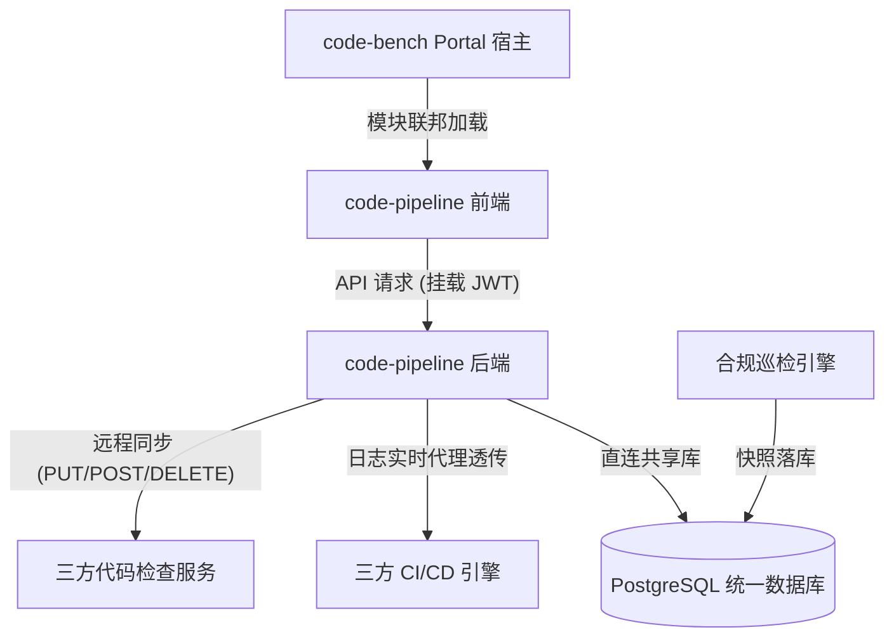

# Code Pipeline 流水线管理与检查系统 (Remote) 🚀

`code-pipeline` 是 CodeBench 微前端集成工作台下的**持续集成/持续交付流水线调度、三方 CI/CD 联动与代码仓合规治理**子系统。该项目作为微前端 Remote 应用，通过 Vite Module Federation (模块联邦) 动态无缝嵌入 CodeBench Portal 宿主中运行。

本系统定位为**三方 CI/CD 流水线的统一交互控制台与代码仓合规管控平台**，为研发团队提供多分支流水线绑定管理、在线方案编辑与三方双向同步、敏感参数安全脱敏、运行日志实时穿透查询、每日构建错峰打散调度，以及全平台代码仓合规自动化巡检与大盘治理能力。

---

## 🎯 核心特性与架构能力

### 1. 流水线执行方案在线管理与三方双向同步
- **方案在线查看与修改**：支持在界面弹窗中直接查看和修改执行方案（`ExecutionScheme`），包括修改方案名称、自定义构建参数、MR 触发开关及触发生效分支、每日构建开关及定时时间、编程语言等。
- **三方系统双向联动同步**：当修改方案的编程语言或配置时，后端服务（`SyncUpdateCheckerTaskRemote`）自动联动向三方 CI/CD 系统发起 `PUT` 请求，同步更新远端代码检查任务与执行方案。
- **代码检查任务复用与生命周期管理**：创建方案时智能复用现有匹配的代码检查任务；当删除代码仓下的最后一个执行方案时，后端自动触发逆向级联删除，彻底清理远端三方关联的代码检查任务，杜绝外部脏数据残留。
- **敏感参数权限脱敏**：非管理员角色在查看仓库执行方案时，系统自动对敏感构建参数值进行脱敏模糊（`***`）处理，防范鉴权凭据与密钥泄露。

### 2. 零本地日志与实时代理透传架构
- **高性能穿透代理**：系统摒弃臃肿的本地执行日志库，在用户查询运行日志和构建状态时，后端通过代理调用向真正的第三方 CI/CD 引擎发起实时透传，返回高保真执行轨迹，极致精简数据库负载。
- **直达外部超链接**：日志弹窗提供一键直达三方 CI/CD 控制台的超链接，便于深度追溯。

### 3. 被管代码仓 (Managed Repository) 与分支治理
- **层级化被管组管理**：支持树状嵌套组结构（`ManagedGroup`），支持按组批量管理代码仓归档、隐藏与成员权限，支持移除根组时原子级联清理底层数据。
- **分支健康度巡检**：定期刷新代码仓分支状态，自动标记为 `active`（活跃）、`merged_stale`（已合并待清理）、`unmerged_stale`（未合并僵尸）三种状态。
- **保护分支规则与全员审批流**：支持保护分支模式匹配（如 `release/*`），建仓申请与保护分支规则变更均需通过审批单（`ManagedRepoApproval`）流转。
- **跨仓特性分支批量同步**：支持一次性勾选多个代码仓与基准分支，一键批量拉起特性分支并记录批次执行日志（`ManagedBatchBranchLog`）。

### 4. 代码仓合规性巡检体系 (Compliance Engine)
- **6 大维度 11 项自动巡检指标**：
  1. **分支保护**：默认分支保护检查、保护分支覆盖率
  2. **工程规范**：代码检查任务绑定、流水线/执行方案绑定
  3. **责任归属**：仓库负责人设置、所属部门/子系统关联
  4. **分支健康**：未合并僵死分支上限控制、已合并滞留分支清理提示
  5. **元信息规范**：仓库描述与标签完备度
  6. **权限管控**：Owner 级别高权限成员数量管控
- **全局统一基线与等级划分**：支持管理员自定义规则权重与扣分阈值，实时划分 **A 级 (≥90分)**、**B 级 (75-89分)**、**C 级 (60-74分)**、**D 级 (<60分)**。
- **合规治理 Dashboard**：直观展示全站合规率 KPI 卡片、合规等级分布图表、僵死分支 Top5 榜单及高危代码仓整改清单。

### 5. 错峰调度与 APIG 统一认证
- **每日构建错峰打散**：每日构建触发时间升级为在 `00:00` 至 `08:00` 之间随机打散触发，有效平抑集群并发构建峰值。
- **APIG Token 双轨认证**：支持 `enable_apig_auth` 双轨控制开关，内置 `TokenManager` 内存缓存（1 小时有效期）并在过期前 5 分钟并发安全自动刷新。

---

## 🧩 架构设计与数据流


```mermaid
graph TD
    Host[code-bench Portal 宿主] -- "模块联邦加载" --> CP_Web[code-pipeline 前端]
    CP_Web -- "API 请求 (挂载 JWT)" --> CP_API[code-pipeline 后端]
    CP_API -- "直连共享库" --> PG[(PostgreSQL 统一数据库)]
    CP_API -- "日志实时代理透传" --> ThirdParty_CI[三方 CI/CD 引擎]
    CP_API -- "远程同步 (PUT/POST/DELETE)" --> ThirdParty_Checker[三方代码检查服务]
    Engine[合规巡检引擎] -->|快照落库| PG
```

---

## ⚙️ 系统配置指南 (config.yaml)

```yaml
server:
  port: ":8082"
  gin_log: false

# ── 数据库配置 (共享 PostgreSQL) ──
database:
  host: "127.0.0.1"
  port: 5432
  user: "postgres"
  password: "YOUR_POSTGRES_PASSWORD"
  dbname: "code_shield"
  sslmode: "disable"

# ── 认证与门户连接 ──
auth:
  jwt_secret: "YOUR_SHARED_JWT_SECRET_KEY"

code_bench:
  api_url: "http://192.168.56.18:8000"  # Portal 宿主主应用基准地址

# ── APIG 统一认证配置 (可选) ──
enable_apig_auth: false
apig:
  token_url: "https://apig.example.com/oauth/token"
  token_account: "service_account"
  token_password: "service_password"
  mr_binding_url: "https://apig.example.com/api/v1/mr-bindings"
```

---

## 🛠️ 快速开始

### 1. 一键全系统构建
```bash
# 安装前端依赖、打包生成 dist/，并编译 Go 后端二进制
make build
```

### 2. 运行服务
```bash
make run
```
默认监听 `:8082` 端口。

### 3. 前端独立开发
```bash
cd frontend
npm install
npm run dev
```

---

## 📁 目录结构

```text
code-pipeline/
├── config.yaml             # 服务配置文件
├── main.go                 # 程序入口与路由定义
├── models/                 # 实体模型（引用 code-common/backend）
│   ├── config.go           # 本地配置解析
│   └── models.go           # Pipeline / Scheme / Baseline / Report 等模型
├── handlers/               # HTTP API 控制层
│   ├── execution.go        # 方案与执行管理（支持在线修改与脱敏）
│   ├── pipeline_sync.go    # 三方流水线与方案同步逻辑
│   ├── managed_repo.go     # 被管代码仓与组管理
│   ├── managed_approval.go # 建仓与保护分支审批流
│   ├── managed_batch_branch.go # 跨仓批量拉分支
│   ├── compliance.go       # 合规基线与报告接口
│   ├── auth.go             # 统一鉴权
│   └── helpers.go          # 公共 Header 与 SSO 异常处理
├── services/               # 核心业务服务
│   ├── pipeline_client.go  # 三方 CI/CD 接口客户端
│   ├── pipeline_client_apig.go # APIG 规范客户端
│   ├── compliance_engine.go # 6 大维度合规巡检引擎
│   ├── branch_audit.go     # 分支健康度审计
│   └── token_manager.go    # APIG Token 内存缓存与自动刷新
├── utils/                  # 模板引擎与占位符解析
├── frontend/               # React 前端工程 (接入 @code/common)
├── docs/                   # 占位符与三方接口规范文档
└── Makefile                # 自动化编译脚本
```

---

## 🏷️ 版本历史

### v0.9.0 (2026-08-14)
*   **执行方案在线修改与三方双向同步**：
    - 全面解锁执行方案弹窗中的在线编辑功能，支持修改方案名称、构建参数、MR 触发配置、每日构建时间及编程语言。
    - 引入 `SyncUpdateCheckerTaskRemote`，修改编程语言时自动向三方发起 `PUT` 请求联动更新远程代码检查任务。
    - 修复创建执行方案时代码检查任务复用失效与任务名称为空缺陷。
    - 删除代码仓最后一个执行方案时，自动逆向级联删除三方关联的代码检查任务。
*   **敏感参数安全脱敏**：非管理员查看方案时自动对敏感构建参数值进行脱敏模糊（`***`）处理。
*   **数据一致性与事务原子性加固**：全面修复 Code Review 提出的 15 项数据一致性、事务原子性与并发改名隐患。
*   **全量接入 `code-common`**：后端下沉 `User`、`DatabaseConfig`，清场重复的 `PortalClaims`；前端统一接入 `@code/common` 组件与 Token 常量。
*   **被管仓根组级联清理**：支持删除根组时原子级联清理所有底层被管仓库与分支规则。

### v0.8.0 (2026-08-09)
*   **代码仓合规性巡检体系与看板**：
    - 新增 6 大维度 11 项指标的合规巡检引擎（[compliance_engine.go](file:///home/fugui/codes/code-pipeline/services/compliance_engine.go)）。
    - 新增全局统一合规基线管理与 Dashboard 页面，展示 KPI、等级分布与僵死分支 Top5。
*   **每日构建时间错峰打散**：每日构建时间在 `00:00` 至 `08:00` 间随机打散触发，防止高峰期并发构建拥堵。
*   **模板引擎增强**：支持 `{CURRENT_TIME}` 格式化时间戳占位符。

### v0.7.0 (2026-08-01)
*   **被管代码仓与分支管控**：引入嵌套组结构的被管仓管理、分支健康度分类、保护分支规则与审批单流转。
*   **跨仓批量分支同步**：支持多仓批量拉起特性分支并记录执行日志。

### v0.6.0 (2026-07-28)
*   **APIG 统一账号 Token 认证**：新增 `enable_apig_auth` 双轨控制与 `TokenManager` 自动刷新机制。
