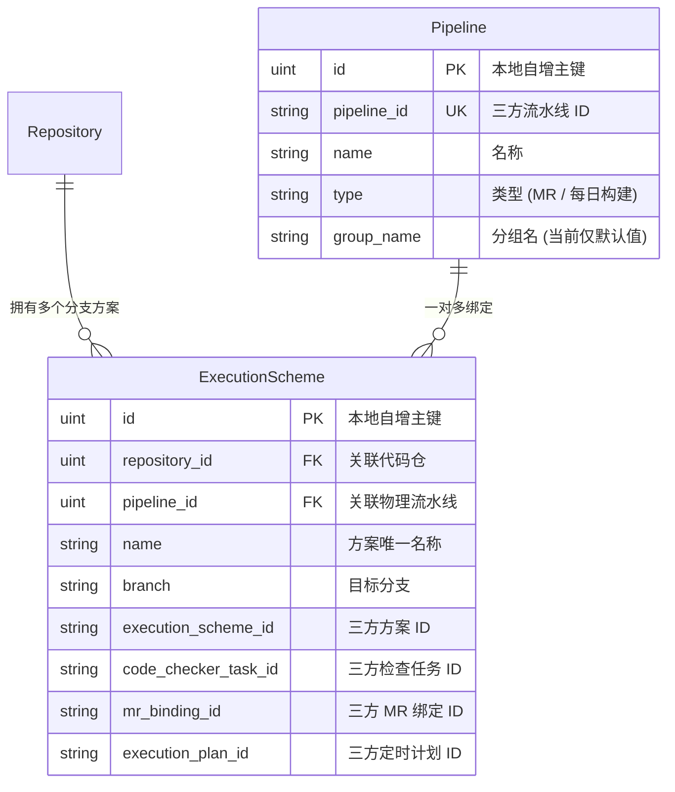
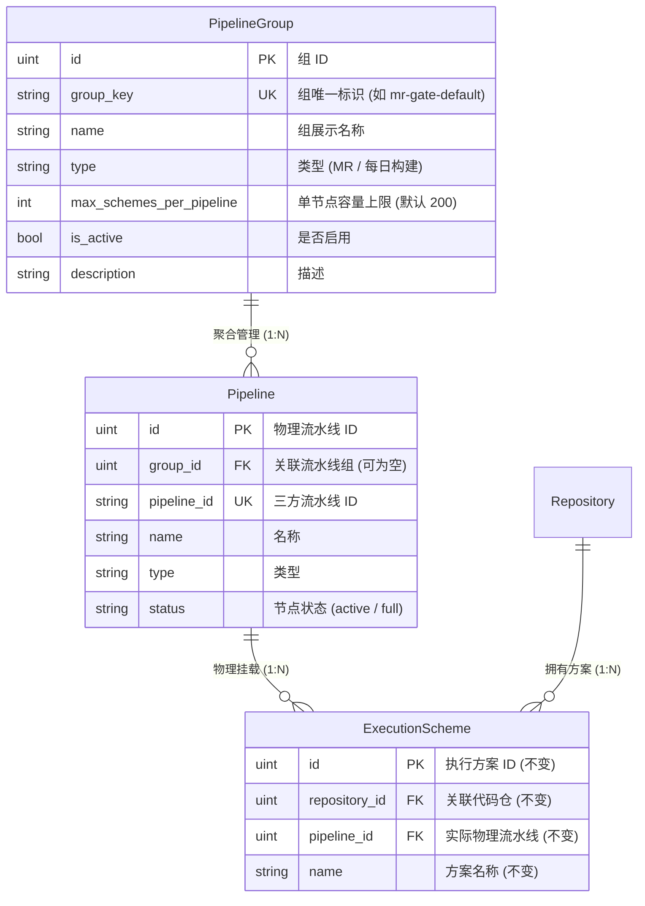
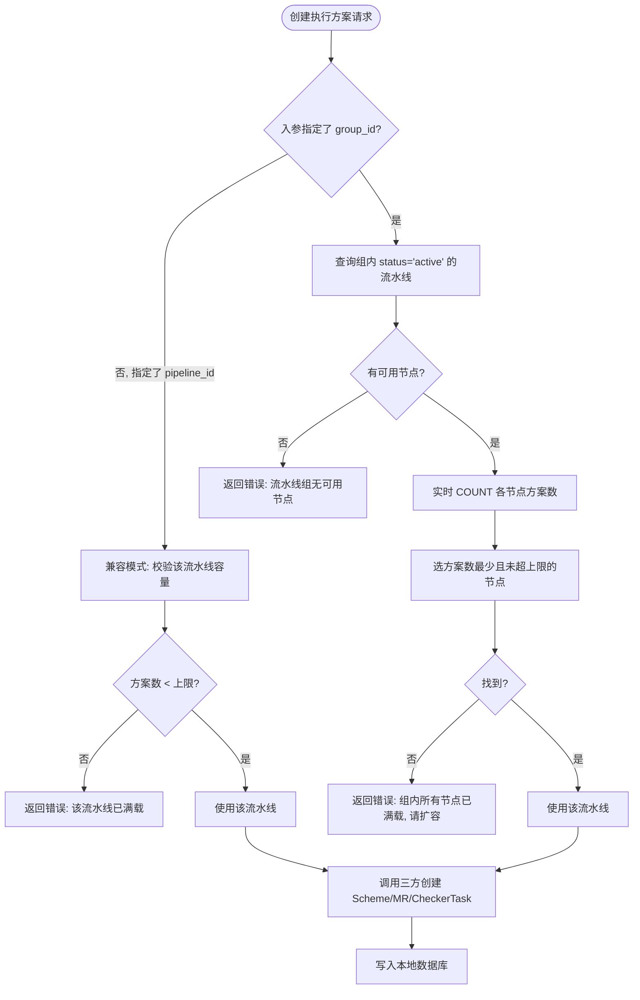
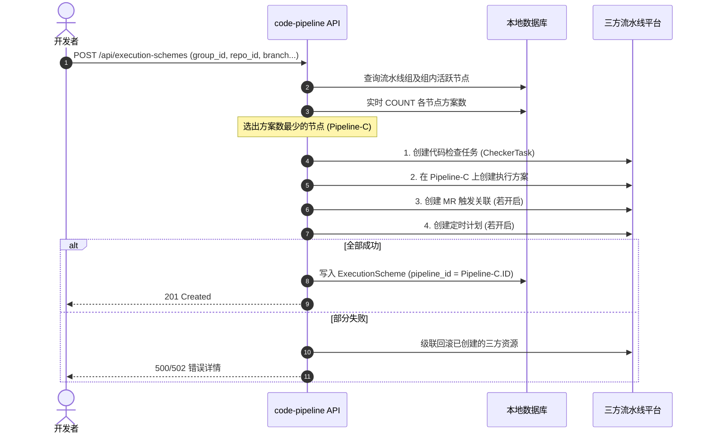

# CodePipeline 流水线组 (Pipeline Group) 设计文档 📐

> **版本**: v2.0 (精简版)
> **日期**: 2026-08-24

---

## 1. 背景与问题

### 1.1 现有关系

在 `code-pipeline` 系统中，**流水线（Pipeline）** 与 **执行方案（ExecutionScheme）** 为标准的 **1:N（一对多）** 关系：



- **流水线（Pipeline）**：对应三方 CI/CD 平台中的一条顶层 Pipeline 实例，定义构建阶段、插件链、运行环境。
- **执行方案（ExecutionScheme）**：具体代码仓在特定分支下的个性化执行配置，包含 CheckerTask、MRBinding、ExecutionPlan 等三方资源。

### 1.2 核心痛点

三方流水线引擎对单条流水线支持挂载的执行方案数量存在**硬性上限**。随着纳管代码仓与分支数量增长，单条流水线的方案数量逼近上限，导致：

1. **创建失败**：超出上限后三方系统拒绝创建新方案。
2. **人工调度负担**：管理员被迫手工创建多条同质流水线（如 `Pipeline-01`、`Pipeline-02`），开发人员需要人工猜测哪条还有空位。
3. **负载不均衡**：部分流水线过载，另一些空置，缺乏自动均衡能力。

### 1.3 解决思路

引入**"流水线组 (Pipeline Group)"** 概念——将功能相同的多条物理流水线聚合为一个逻辑资源池，创建执行方案时系统自动选择负载最轻的流水线。

> **需确认的关键事实**（影响实施细节与优先级）：
>
> | 问题 | 影响 |
> | :--- | :--- |
> | 三方平台单条流水线的方案上限具体是多少？ | 决定 `max_schemes_per_pipeline` 默认值 |
> | 当前方案数最多的流水线挂了多少个方案？ | 决定实施紧迫度 |
> | 同类型流水线在三方平台的阶段配置是否完全相同？ | 决定分组策略是否成立 |

---

## 2. 核心概念

```
                          ┌──────────────────────────────────────────────┐
                          │          流水线组 (Pipeline Group)            │
                          │  - 容量: 3 条物理流水线 (总容量 600, 已用 245) │
                          │  - 调度: 自动选方案数最少的节点                │
                          └──────────────────────┬───────────────────────┘
                                                 │ 自动路由
               ┌─────────────────────────────────┼─────────────────────────────────┐
               ▼                                 ▼                                 ▼
┌──────────────────────────────┐  ┌──────────────────────────────┐  ┌──────────────────────────────┐
│  物理流水线 A (active)       │  │  物理流水线 B (active)       │  │  物理流水线 C (active)       │
│  方案数: 100/200 (50%)       │  │  方案数: 140/200 (70%)       │  │  方案数: 5/200 (2.5%)        │
└──────────────────────────────┘  └──────────────────────────────┘  └──────────────────────────────┘
                                                                           ▲
                                                                    [新方案自动分配至此]
```

**同质性要求**：组内流水线必须具备相同的触发类型、阶段步骤和参数兼容性——对执行方案而言，分配到组内的哪条流水线，执行效果完全等价且透明。

---

## 3. 数据模型设计

### 3.1 设计原则

1. **不在 `ExecutionScheme` 上冗余 `group_id`**——方案的组归属可通过 `pipeline_id → Pipeline → group_id` 推导，避免数据不一致。
2. **不使用冗余计数器**——用实时 `COUNT(*)` 查询真实方案数，避免并发场景下计数器漂移。
3. **只有两个节点状态** (`active` / `full`)——取消 readonly/draining/offline，减少运维复杂度。
4. **路由策略只有一种**——最小方案数优先（硬编码），不做策略模式抽象。

### 3.2 实体关系图



### 3.3 Go Struct 定义

#### (1) 新增 `PipelineGroup`

```go
// PipelineGroup 流水线组
type PipelineGroup struct {
    ID                    uint      `gorm:"primaryKey" json:"id"`
    GroupKey              string    `gorm:"size:100;uniqueIndex;not null;default:''" json:"group_key"` // 组唯一标识，如 "mr-gate-default"
    Name                  string    `gorm:"size:150;not null;default:''" json:"name"`                  // 组展示名称
    Type                  string    `gorm:"size:50;index;not null;default:'MR'" json:"type"`           // 类型: "MR" | "每日构建"
    MaxSchemesPerPipeline int       `gorm:"default:200" json:"max_schemes_per_pipeline"`              // 单节点容量上限
    IsActive              bool      `gorm:"default:true" json:"is_active"`                             // 是否启用
    Description           string    `gorm:"type:text" json:"description"`
    CreatedAt             time.Time `json:"created_at"`
    UpdatedAt             time.Time `json:"updated_at"`
}
```

#### (2) 改造 `Pipeline`（仅新增 2 个字段）

```diff
 type Pipeline struct {
     ID          uint      `gorm:"primaryKey" json:"id"`
+    GroupID     *uint     `gorm:"index" json:"group_id"`                             // 关联的流水线组 ID (空代表独立流水线)
+    Group       *PipelineGroup `gorm:"foreignKey:GroupID" json:"group,omitempty"`
     PipelineID  string    `gorm:"uniqueIndex;not null;default:''" json:"pipeline_id"`
     Name        string    `gorm:"not null;default:''" json:"name"`
     Type        string    `gorm:"not null;default:''" json:"type"`
+    Status      string    `gorm:"size:20;default:'active'" json:"status"`            // "active" | "full"
     GroupName   string    `json:"group_name"`     // 保留兼容旧字段
     Description string    `json:"description"`
     // ... 其余字段完全不变 ...
 }
```

#### (3) `ExecutionScheme` —— 零改动

现有结构完全保持不变。方案的组归属通过已有的 `pipeline_id → Pipeline.group_id` 关联链获取。

---

## 4. 核心调度算法

### 4.1 最小方案数优先 (Least-Allocated)



### 4.2 Go 调度函数实现

```go
// SelectPipelineInGroup 在指定流水线组中选出负载最轻的物理流水线
func SelectPipelineInGroup(tx *gorm.DB, groupID uint) (*models.Pipeline, error) {
    var group models.PipelineGroup
    if err := tx.First(&group, groupID).Error; err != nil {
        return nil, fmt.Errorf("流水线组 (ID: %d) 不存在: %w", groupID, err)
    }
    if !group.IsActive {
        return nil, fmt.Errorf("流水线组 [%s] 已禁用", group.Name)
    }

    cap := group.MaxSchemesPerPipeline
    if cap <= 0 {
        cap = 200
    }

    // 实时聚合查询：查组内 active 的流水线，按实际方案数升序，取最空闲的
    type candidate struct {
        models.Pipeline
        SchemeCount int64 `gorm:"column:scheme_count"`
    }
    var results []candidate
    err := tx.Raw(`
        SELECT p.*, COALESCE(c.cnt, 0) AS scheme_count
        FROM pipelines p
        LEFT JOIN (
            SELECT pipeline_id, COUNT(*) AS cnt
            FROM execution_schemes
            GROUP BY pipeline_id
        ) c ON c.pipeline_id = p.id
        WHERE p.group_id = ? AND p.status = 'active'
        ORDER BY scheme_count ASC
    `, groupID).Scan(&results).Error
    if err != nil {
        return nil, fmt.Errorf("查询组内流水线失败: %w", err)
    }

    if len(results) == 0 {
        return nil, fmt.Errorf("流水线组 [%s] 无可用节点", group.Name)
    }

    // 选择第一个未超上限的节点
    for i := range results {
        if results[i].SchemeCount < int64(cap) {
            return &results[i].Pipeline, nil
        }
        // 顺带自愈：标记已满的节点为 full
        tx.Model(&models.Pipeline{}).Where("id = ?", results[i].ID).Update("status", "full")
    }

    return nil, fmt.Errorf("流水线组 [%s] 所有节点已满载 (%d/%d)，请联系管理员扩容",
        group.Name, len(results), cap)
}
```

### 4.3 方案删除后的状态自愈

当执行方案被删除后，检查对应流水线是否从满载状态恢复：

```go
// healPipelineStatus 删除方案后检查并恢复流水线状态
func healPipelineStatus(pipelineID uint) {
    var pipeline models.Pipeline
    if err := database.DB.Preload("Group").First(&pipeline, pipelineID).Error; err != nil {
        return
    }
    if pipeline.Status != "full" || pipeline.GroupID == nil {
        return
    }

    cap := 200
    if pipeline.Group != nil && pipeline.Group.MaxSchemesPerPipeline > 0 {
        cap = pipeline.Group.MaxSchemesPerPipeline
    }

    var count int64
    database.DB.Model(&models.ExecutionScheme{}).Where("pipeline_id = ?", pipelineID).Count(&count)
    if count < int64(cap) {
        database.DB.Model(&pipeline).Update("status", "active")
    }
}
```

---

## 5. 创建执行方案时序图



---

## 6. API 接口设计

### 6.1 流水线组管理接口 (Admin)

#### 获取流水线组列表

```
GET /api/pipeline-groups
```

响应示例：
```json
[
  {
    "id": 1,
    "group_key": "mr-gate-default",
    "name": "MR 门禁通用流水线组",
    "type": "MR",
    "max_schemes_per_pipeline": 200,
    "is_active": true,
    "pipeline_count": 3,
    "total_capacity": 600,
    "used_schemes": 245
  }
]
```

> 注：`pipeline_count`、`total_capacity`、`used_schemes` 为接口层实时聚合计算返回，非数据库冗余字段。

#### 创建流水线组

```
POST /api/pipeline-groups
```

```json
{
  "group_key": "mr-gate-default",
  "name": "MR 门禁通用流水线组",
  "type": "MR",
  "max_schemes_per_pipeline": 200,
  "description": "承载所有 MR 门禁自动化检查任务"
}
```

#### 将流水线加入/移出组

```
POST /api/pipeline-groups/:id/pipelines
```

```json
{
  "pipeline_ids": [12, 13, 14],
  "action": "attach"
}
```

`action` 取值：`"attach"` (加入) | `"detach"` (移出)。

### 6.2 创建执行方案接口改造

现有接口 `POST /api/execution-schemes` 保持向后兼容，请求体扩展一个可选的 `group_id` 字段：

```json
{
  "group_id": 1,
  "repository_id": 108,
  "name": "payment_service_mr",
  "branchs": "master",
  "languages": "Java, Go",
  "mr_trigger": true,
  "daily_build": true
}
```

**兼容规则**：

| 入参组合 | 行为 |
| :--- | :--- |
| 指定 `group_id` | ✅ 推荐方式。系统自动调度组内最优流水线 |
| 指定 `pipeline_id` (无 `group_id`) | 兼容模式。校验容量后直接绑定至指定流水线 |
| 两者都不指定 | 根据系统默认活跃组进行调度（若有） |

---

## 7. 前端交互改造

### 7.1 执行方案创建弹窗 (`ExecutionSchemeModal`)

- **新增方案时**：原来的"关联流水线"下拉改为"关联流水线组"下拉。选项展示组名称和实时容量使用概况（如 `MR 门禁组 — 已用 245/600, 40%`）。
- **编辑方案时**：只读展示当前方案实际绑定的物理流水线名称（保持不变）。
- **兼容展开**：提供"高级选项 — 指定特定物理流水线"折叠面板，供管理员精确指定。

### 7.2 流水线管理页面 (`PipelineConfig`)

- 在现有流水线列表上方，新增**流水线组卡片**区域，展示各组的名称、类型、节点数量、容量使用率。
- 每张组卡片支持"添加流水线到组"和"从组中移除"操作。
- 在流水线表格中新增"所属组"和"状态"列。

---

## 8. 数据迁移策略

在系统启动时（`database/migrate.go`）执行以下自动迁移：

1. **创建 `pipeline_groups` 表**（GORM AutoMigrate）。
2. **创建系统默认组**：
   - 按现有 `Pipeline.Type` 自动创建默认流水线组：
     - `mr-gate-default` — "默认 MR 门禁流水线组" (`type = "MR"`)
     - `daily-build-default` — "默认每日构建流水线组" (`type = "每日构建"`)
3. **归集现有流水线**：
   - 扫描所有 `Pipeline`，按 `Type` 将其 `group_id` 指向对应默认组。
   - 将 `status` 初始化为 `"active"`。

```go
func migratePipelineGroups(db *gorm.DB) {
    db.AutoMigrate(&models.PipelineGroup{})

    // 按类型自动创建默认组
    defaults := []models.PipelineGroup{
        {GroupKey: "mr-gate-default", Name: "默认 MR 门禁流水线组", Type: "MR", MaxSchemesPerPipeline: 200, IsActive: true},
        {GroupKey: "daily-build-default", Name: "默认每日构建流水线组", Type: "每日构建", MaxSchemesPerPipeline: 200, IsActive: true},
    }
    for _, g := range defaults {
        db.Where("group_key = ?", g.GroupKey).FirstOrCreate(&g)
    }

    // 将现有流水线按类型归入默认组
    for _, g := range defaults {
        var saved models.PipelineGroup
        if db.Where("group_key = ?", g.GroupKey).First(&saved).Error == nil {
            db.Model(&models.Pipeline{}).
                Where("type = ? AND group_id IS NULL", saved.Type).
                Update("group_id", saved.ID)
        }
    }

    // 初始化 status 字段
    db.Model(&models.Pipeline{}).Where("status = '' OR status IS NULL").Update("status", "active")
}
```

---

## 9. 异常处理

| 异常场景 | 处理方式 |
| :--- | :--- |
| 组内所有物理流水线均已满载 | 返回明确错误 `"流水线组 [X] 所有节点已满载，请联系管理员扩容"`，同时记录审计日志 |
| 三方平台创建方案失败 | 级联回滚已创建的三方资源（CheckerTask / MRBinding / ExecutionPlan），保持事务一致性 |
| 方案删除后流水线状态不一致 | 删除方案后自动调用 `healPipelineStatus` 检查并恢复 `active` 状态 |
| 并发创建方案 | 依赖数据库事务隔离级别保障；由于方案创建频率低（非高并发热点），无需额外分布式锁 |

---

## 10. 未来演进方向

以下能力在当前阶段**不实现**，但方案 B 的架构已预留扩展空间：

| 特性 | 扩展方式 |
| :--- | :--- |
| 节点排空 / 跨节点迁移 | 给 `Pipeline.status` 新增 `draining` 值，编写迁移脚本 |
| 容量告警通知 | 在获取组信息时计算使用率，超 85% 推送通知 |
| 自动扩容 (Auto-Scale) | 监听容量阈值，调用三方 API 克隆创建新流水线并加入组 |
